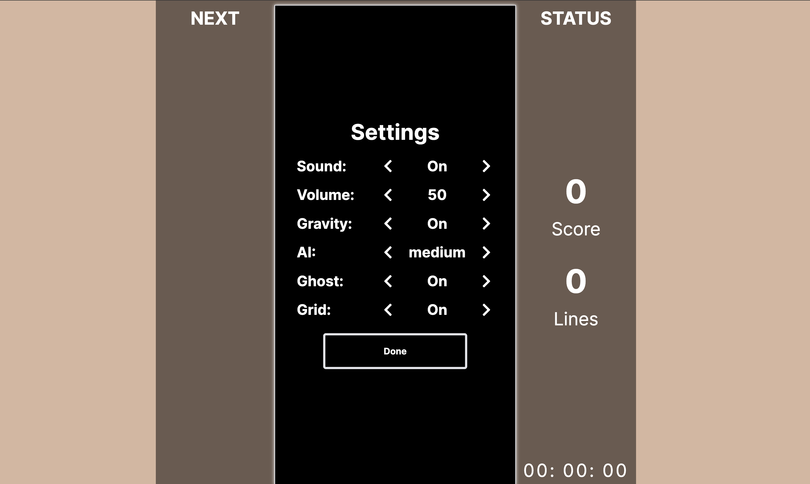

# Tetris AI Challenge

This is a Tetris game build with React, with AI competition mode integrated.
### Open [tetris.zackhu.com](https://tetris.zackhu.com) to play!
### AI Competition Mode


### Feature:
- This project's frontend is developed with React, Nextjs, tailwindCSS and Zustand.
- Backend AI model is deployed on an AWS EC2 server.
- Beside the sprint and infinite mode, **AI competition mode** is supported, with **3 dificulty levels.**
- Easy level AI is implemented with **heuristic based method**, which run in local machine, while medium and hard is implemented with **DQN**. 

# Some Screenshots
### Main Menu


### Sprint Mode


### Setting Page



**Folder structure:**
```
src
| - app
|    | - firebase           - configuration file for firebase backend
|    | - globals.css        - global css configuration file
|    | - layout.tsx         - UI that shared between routes
|    | - page.tsx           - root page, with route '/'
|
| - components
     | - MenuButton         - Unify menu button style
     | - Modal
        | - BasicModal      - The basic modal component (all the followinng components would be rendered on top of it)
        | - Control         - The control page that would be displayed on the modal when user click control on the main menu
        | - MainMenu        - The main menu page ...
        | - Pause           - The pause page ...
        | - Setting         - The setting page ...
     | - Panels             - Controls the behavior of all those panels
     | - PlayField          - The area where the main gameplay occurs
     | - Timer              - 'functional' component as its name suggests 
     | - GameBoard          - Store global game states
```


## To run this project

#### Install dependency
```
npm install
```

#### Run on local server
```
npm run dev
```

#### Build pacakge
```
npm run build
```


